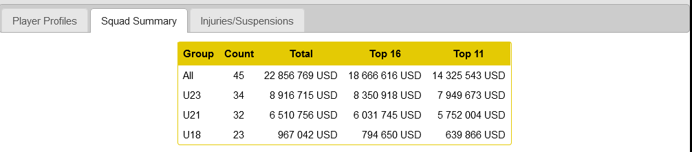

# MZ Player Values
This is a userscript that adds a table to 'Squad Summary' to show player values in groups such as 'Top 11 - U23'.
Also it adds a 'Squad' button in front of each team in 'Clash' page to go directly to the team 'squad summary'.

