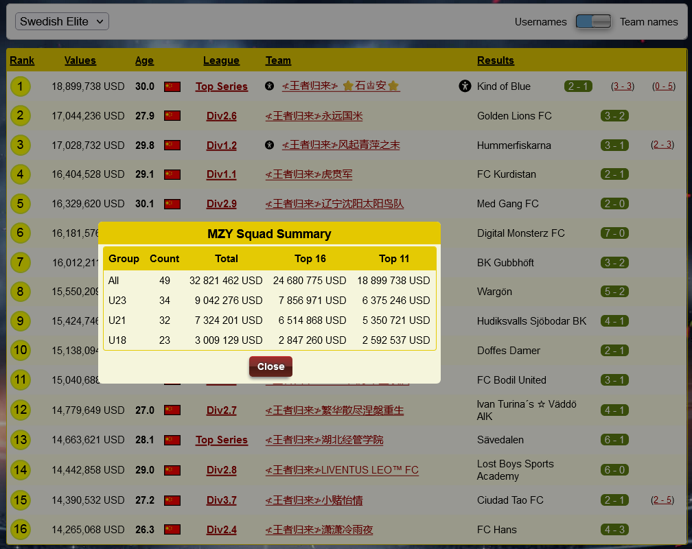

# MZ Player Values
This is a userscript that adds a table to 'Squad Summary' to show player values in groups such as 'Top 11 - U23'.  
Also it adds a yellow 'S' button in front of each team in 'Clash' page to view 'squad summary' in place.

