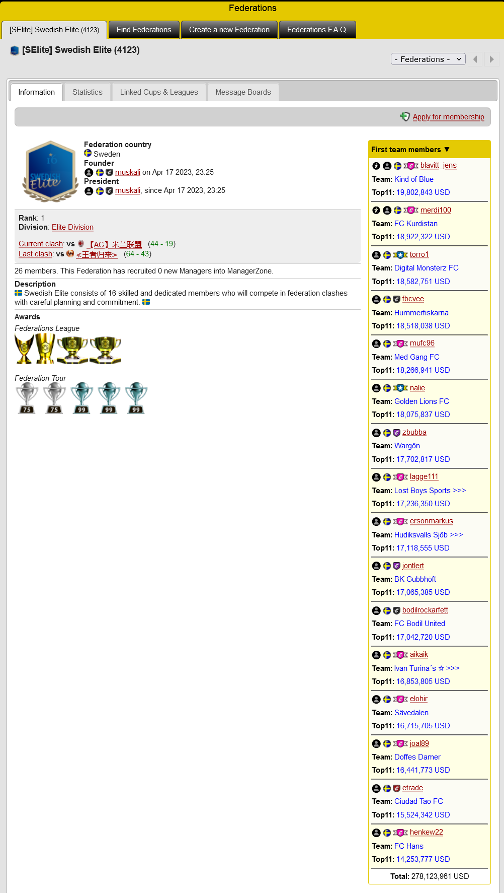

# MZ Player Values
This is a userscript to add some features to [www.managerzone.com](www.managerzone.com) pages.  

## In Squad Summary

Adds a table to 'Squad Summary' to show player values in groups such as 'Top 11 - U23'.  

## In Federation Front Page

Adds values of top 11 players of first team members and name of the teams. Then it sorts the teams by their value.  

## In Clash Page

Adds team rank in its federation, based on its Top 11 players.  
Adds a yellow 'S' button in front of each team. Click to view the 'squad summary' in place.  

## In Match Page

Adds starting lineup value.  
Also adds a new column to display player values.

